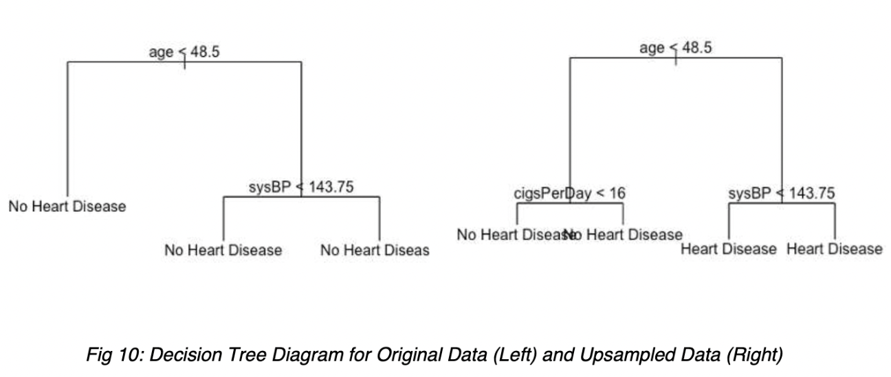
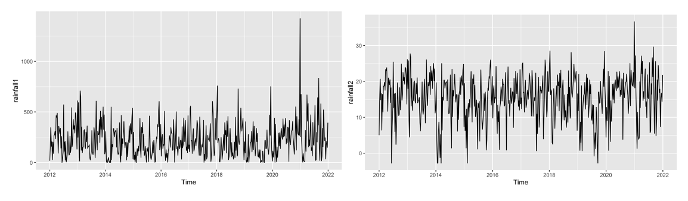
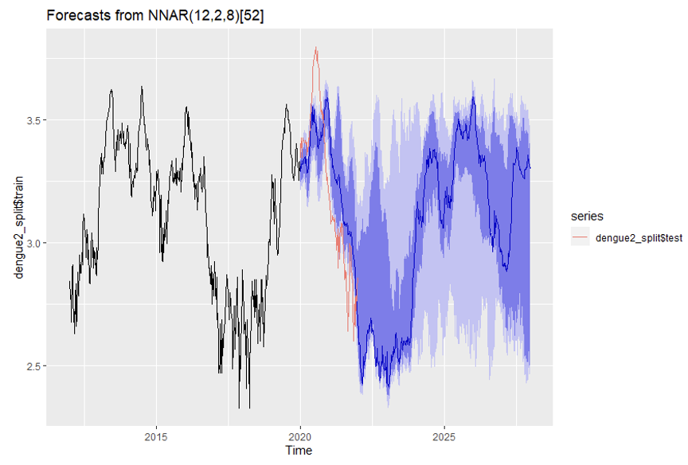
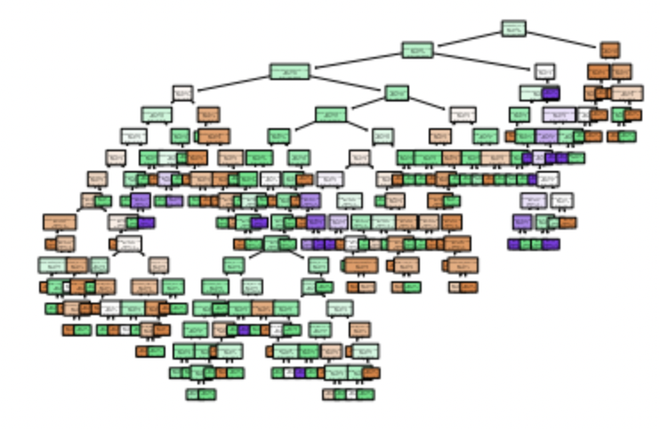
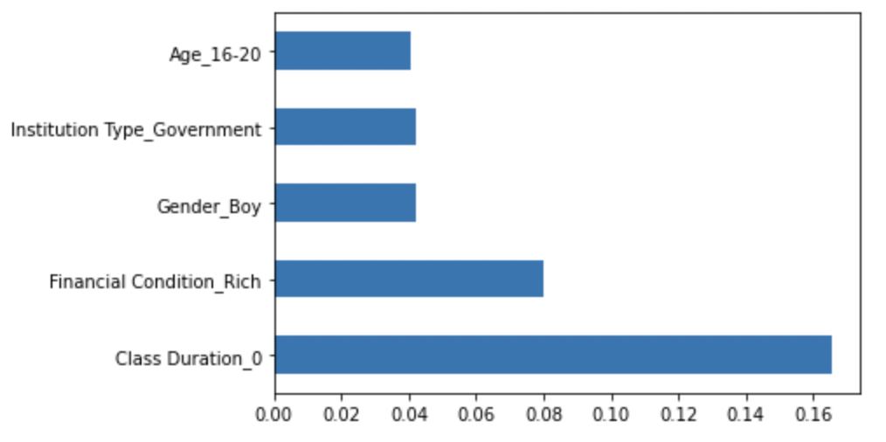

## Data Science

---
### Predict Heart Disease with Framingham Dataset (R)

In this project I am going to perform upsampling on the heart disease dataset, then use logistic regression with kfold, decision trees and bagging algorithm to predict if the person has heart disease.

 

 

---
### Forecasting Dengue Incidence in Singapore (R)

I applied BoxCox transformation on rainfall and temperature data. Next, I used various ARIMA models (SARIMA, ARIMAX, ARIMA, SARIMAX) and feed forward neural networks to forecast dengue cases. Seasonal naive and dynamic harmonic regression methods were used. 

 

 

---
### Kaggle: Students' Adaptivity Level in Online Education (Python)

I performed various feature engineering and selection methods, used logistic regression with lasso, PCA, SVM, Decision Trees, Random Forest and KNN to predict students' adaptivity. 

 

 

---
### Classifying cat and dogs using Convolution Neural Network CNN (Python)

I built a CNN classifier using Asirra dataset to identify cats and dogs. 

 

 

---

Page template forked from <a href="https://github.com/evanca/quick-portfolio">evanca</a>

<!-- Remove above link if you don't want to attibute -->
